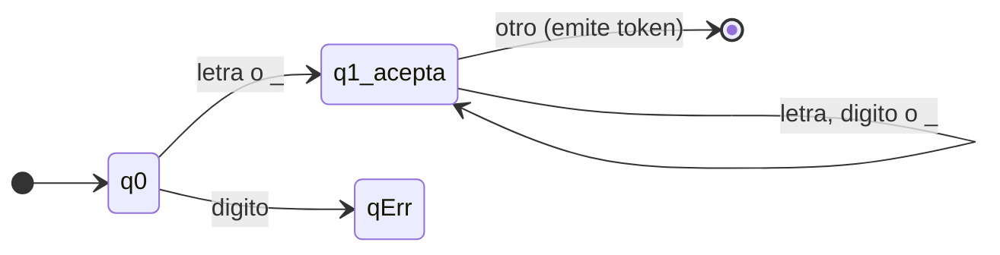
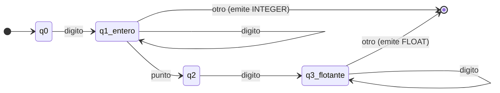
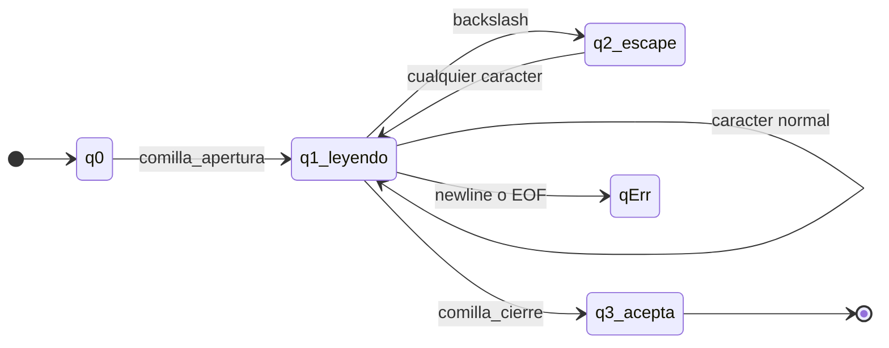
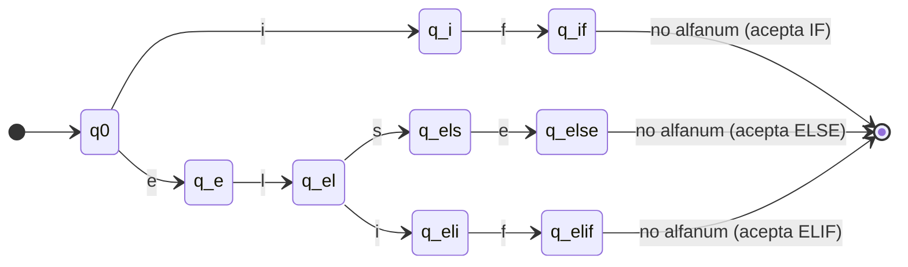
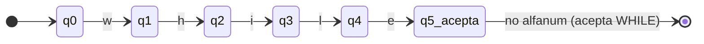
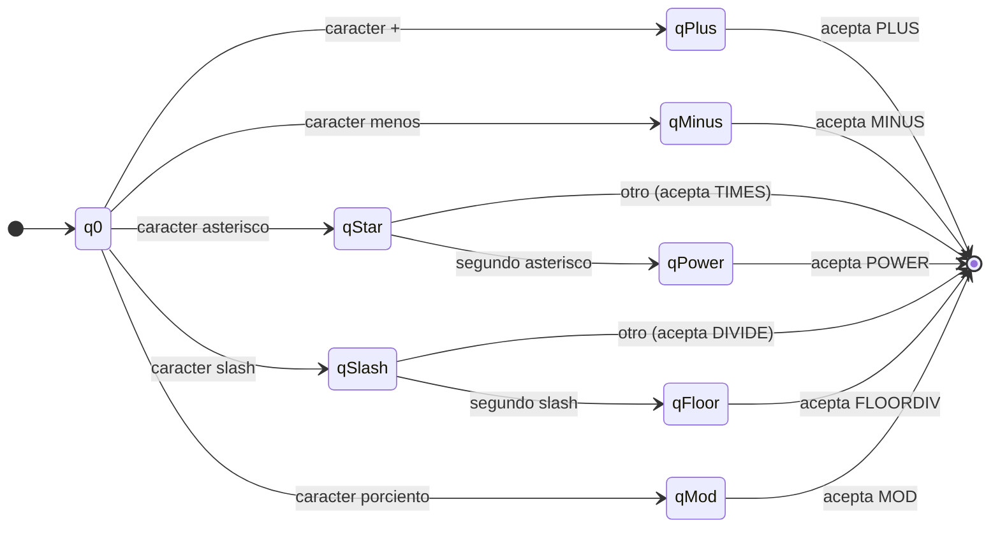

<div align="center">

# Tecnológico de Monterrey
### Escuela de Ingeniería y Ciencias

---

# Analizador Léxico para el Lenguaje<br>Triton GPU Kernel

### Implementación con UNIX-lex (flex) y C++

---

**TC3002B — Computer Science Advanced Applications Development**

**Módulo 3: Compilers — Step I: Lexical Analysis Phase**

<br>

|  |  |
|--|--|
| **Autores:** | Jose Maria Soto Valenzuela — A01254831 |
| | Cesal Alan Silva Ramos — A0XXXXXXX |
| | Julian Espinoza — A0XXXXXXX |
| | Fong — A0XXXXXXX |
| **Profesor:** | Dr. Salvador Hinojosa |
| **Campus:** | Guadalajara |
| **Fecha:** | Abril 2026 |

</div>

<div style="page-break-after: always;"></div>

---

## Tabla de Contenidos

1. [Introducción](#1-introducción)
   - 1.1 [Resumen](#11-resumen)
   - 1.2 [Notación](#12-notación)
2. [Análisis](#2-análisis)
   - 2.1 [Descripción Informal de los Componentes Léxicos](#21-descripción-informal-de-los-componentes-léxicos)
   - 2.2 [Identificación de Tokens y Token IDs](#22-identificación-de-tokens-y-token-ids)
   - 2.3 [Especificación Formal: Expresiones Regulares](#23-especificación-formal-expresiones-regulares)
   - 2.4 [Descripción y Justificación de Mensajes de Error](#24-descripción-y-justificación-de-mensajes-de-error)
3. [Diseño](#3-diseño)
   - 3.1 [Autómatas Finitos Deterministas](#31-autómatas-finitos-deterministas)
   - 3.2 [Tablas de Transición](#32-tablas-de-transición)
   - 3.3 [Gestión de la Tabla de Símbolos](#33-gestión-de-la-tabla-de-símbolos)
4. [Implementación](#4-implementación)
5. [Verificación y Validación](#5-verificación-y-validación)
6. [Plan de Trabajo](#6-plan-de-trabajo)
7. [Referencias](#7-referencias)

<div style="page-break-after: always;"></div>

---

## 1. Introducción

### 1.1 Resumen

Este documento presenta el análisis, diseño, implementación y verificación de un **analizador léxico** (scanner) para un subconjunto del lenguaje **Triton GPU Kernel**. Triton es un lenguaje de dominio específico (DSL) de tipo Python, desarrollado por OpenAI, que permite escribir kernels de GPU de alto rendimiento utilizando sintaxis familiar y operaciones especializadas sobre tensores [2].

El scanner fue implementado utilizando la herramienta **flex** (Fast Lexical Analyzer Generator) con código de usuario en **C++**, conforme a los lineamientos del curso TC3002B. Su función principal es leer un archivo fuente de Triton carácter por carácter y producir dos salidas:

1. **Secuencia de tokens:** Lista ordenada de todos los tokens reconocidos, cada uno con su tipo (Token ID), lexema y número de línea.
2. **Tabla de símbolos:** Registro de identificadores, literales numéricos, literales de cadena y errores léxicos encontrados durante el análisis.

El documento está organizado siguiendo el estándar IEEE-830 [5] y cubre las fases del proceso de desarrollo: análisis de requerimientos (Sección 2), diseño del sistema (Sección 3), implementación (Sección 4), y verificación y validación (Sección 5).

### 1.2 Notación

A lo largo de este documento se utilizan los siguientes formalismos y convenciones:

#### Autómatas Finitos Deterministas (AFD)

Un autómata finito determinista es un modelo matemático que lee una cadena de entrada símbolo por símbolo y decide si la acepta o rechaza. Se define formalmente como una 5-tupla **M = (Q, Σ, δ, q₀, F)** donde:

- **Q** es un conjunto finito de estados.
- **Σ** es el alfabeto de entrada (conjunto finito de símbolos).
- **δ: Q × Σ → Q** es la función de transición, que dado un estado actual y un símbolo de entrada, produce exactamente un estado siguiente.
- **q₀ ∈ Q** es el estado inicial.
- **F ⊆ Q** es el conjunto de estados de aceptación.

La propiedad fundamental del AFD es que es **determinista**: para cada par (estado, símbolo) existe exactamente una transición, lo que garantiza una ejecución eficiente en tiempo O(n) donde n es la longitud de la entrada [1].

#### Expresiones Regulares

Las expresiones regulares son una notación algebraica para describir conjuntos de cadenas (lenguajes regulares). Las operaciones utilizadas en este documento son:

| Operación | Notación | Significado |
|-----------|----------|-------------|
| Concatenación | `ab` | La cadena `a` seguida de `b` |
| Unión | `a\|b` | La cadena `a` o la cadena `b` |
| Cerradura de Kleene | `a*` | Cero o más repeticiones de `a` |
| Cerradura positiva | `a+` | Una o más repeticiones de `a` |
| Opcional | `a?` | Cero o una ocurrencia de `a` |
| Clase de caracteres | `[a-z]` | Cualquier carácter en el rango indicado |
| Negación de clase | `[^a]` | Cualquier carácter excepto los indicados |

Las expresiones regulares y los autómatas finitos son formalismos equivalentes en poder expresivo: todo lenguaje que se puede describir con una expresión regular puede ser reconocido por un AFD, y viceversa [1].

#### Tablas de Transición

Una tabla de transición es la representación tabular de la función δ de un AFD. Las filas corresponden a los estados, las columnas a clases de símbolos de entrada, y cada celda indica el estado destino. Se utiliza la convención:
- **→** marca el estado inicial
- **\*** marca los estados de aceptación

#### Justificación del modelo

Se utiliza el modelo de **AFD** para el análisis y diseño porque:
1. Es el modelo estándar para la fase de análisis léxico en compiladores [1].
2. Garantiza reconocimiento en tiempo lineal O(n).
3. Existe correspondencia directa entre las expresiones regulares (especificación) y los AFD (implementación).
4. La herramienta flex convierte internamente las expresiones regulares a AFD optimizados.

#### Justificación de la herramienta

Se utiliza **flex** como herramienta de implementación porque:
1. Genera automáticamente un scanner en C/C++ a partir de expresiones regulares.
2. Implementa internamente la conversión de expresiones regulares a AFN (construcción de Thompson), luego a AFD (construcción de subconjuntos), y finalmente minimiza el AFD (algoritmo de Hopcroft) [1].
3. Es la herramienta estándar de la industria para análisis léxico [4].
4. Permite una correspondencia directa entre la especificación formal y la implementación, facilitando la trazabilidad.

#### Justificación del lenguaje de programación

Se utiliza **C++** como lenguaje para el código de usuario dentro del archivo flex porque:
1. Flex genera código compatible con C/C++.
2. C++ ofrece estructuras de datos dinámicas (`vector`, `string`) que simplifican la gestión de la tabla de símbolos y la lista de tokens.
3. C++ proporciona `iostream` para separar la salida estándar (`cout`) de la salida de errores (`cerr`).

---

## 2. Análisis

Esta sección describe **qué** debe hacer el analizador léxico: los componentes léxicos del lenguaje Triton, su especificación formal, y los errores que debe detectar.

### 2.1 Descripción Informal de los Componentes Léxicos

El subconjunto del lenguaje Triton que el scanner debe reconocer se compone de las siguientes categorías:

1. **Palabras reservadas (Keywords):** 18 palabras con significado especial que no pueden usarse como identificadores.
2. **Identificadores (NAME):** Nombres definidos por el usuario para variables, funciones, etc.
3. **Literales numéricos (NUMBER):** Valores enteros y de punto flotante.
4. **Literales de cadena (STRING):** Secuencias de caracteres delimitadas por comillas dobles.
5. **Operadores:** 18 símbolos para operaciones aritméticas, lógicas, de comparación y asignación.
6. **Delimitadores:** 17 símbolos de puntuación y agrupación.
7. **Indentación:** Tokens de estructura (NEWLINE, INDENT, DEDENT).
8. **Comentarios:** Texto iniciado con `#`, consumido sin generar token.
9. **Espacios en blanco:** Espacios y tabs, consumidos sin generar token.

### 2.2 Identificación de Tokens y Token IDs

Los Token IDs se agrupan por rangos para mantener orden:
- **100–117** → Keywords (18 tokens)
- **200–202** → Identificadores y literales (3 tokens)
- **300–317** → Operadores (18 tokens)
- **400–416** → Delimitadores (17 tokens)
- **500–502** → Indentación/estructura (3 tokens)
- **999**     → Error

---

#### 2.2.1 Keywords (Palabras Reservadas)

Son palabras con significado especial en el lenguaje. No pueden usarse como identificadores.

| # | Token ID | Nombre del Token | Lexema | Descripción |
|---|----------|-----------------|--------|-------------|
| 1 | 100 | TOK_DEF | `def` | Definición de función |
| 2 | 101 | TOK_RETURN | `return` | Retorno de función |
| 3 | 102 | TOK_IF | `if` | Condicional |
| 4 | 103 | TOK_ELSE | `else` | Rama alternativa |
| 5 | 104 | TOK_ELIF | `elif` | Rama condicional alternativa |
| 6 | 105 | TOK_FOR | `for` | Ciclo for |
| 7 | 106 | TOK_WHILE | `while` | Ciclo while |
| 8 | 107 | TOK_IN | `in` | Pertenencia / iteración |
| 9 | 108 | TOK_IS | `is` | Identidad de objeto |
| 10 | 109 | TOK_AND | `and` | Operador lógico AND |
| 11 | 110 | TOK_OR | `or` | Operador lógico OR |
| 12 | 111 | TOK_NOT | `not` | Operador lógico NOT |
| 13 | 112 | TOK_TRUE | `True` | Literal booleano verdadero |
| 14 | 113 | TOK_FALSE | `False` | Literal booleano falso |
| 15 | 114 | TOK_NONE | `None` | Valor nulo |
| 16 | 115 | TOK_PASS | `pass` | Instrucción vacía |
| 17 | 116 | TOK_BREAK | `break` | Salir de ciclo |
| 18 | 117 | TOK_CONTINUE | `continue` | Siguiente iteración de ciclo |

**Total: 18 keywords**

---

#### 2.2.2 Identificadores y Literales

Tokens cuyo lexema varía (no son cadenas fijas).

| # | Token ID | Nombre del Token | Patrón | Descripción |
|---|----------|-----------------|--------|-------------|
| 19 | 200 | TOK_NAME | `[a-zA-Z_][a-zA-Z0-9_]*` | Identificador (variable, función, etc.) |
| 20 | 201 | TOK_NUMBER | `[0-9]+(\.[0-9]+)?` | Literal numérico (entero o flotante) |
| 21 | 202 | TOK_STRING | `"([^"\\\n]|\\.)*"` | Literal de cadena (comillas dobles) |

**Total: 3 tokens**

**Nota:** Las keywords tienen el mismo patrón que NAME. La diferencia se resuelve
por prioridad: las reglas de keywords van ANTES que la regla de NAME en el archivo flex.

---

#### 2.2.3 Operadores

Símbolos que realizan operaciones sobre valores.

| # | Token ID | Nombre del Token | Lexema | Descripción |
|---|----------|-----------------|--------|-------------|
| 22 | 300 | TOK_PLUS | `+` | Suma |
| 23 | 301 | TOK_MINUS | `-` | Resta |
| 24 | 302 | TOK_TIMES | `*` | Multiplicación |
| 25 | 303 | TOK_DIVIDE | `/` | División |
| 26 | 304 | TOK_FLOORDIV | `//` | División entera |
| 27 | 305 | TOK_MOD | `%` | Módulo (residuo) |
| 28 | 306 | TOK_POWER | `**` | Potencia |
| 29 | 307 | TOK_LT | `<` | Menor que |
| 30 | 308 | TOK_GT | `>` | Mayor que |
| 31 | 309 | TOK_LE | `<=` | Menor o igual |
| 32 | 310 | TOK_GE | `>=` | Mayor o igual |
| 33 | 311 | TOK_EQ | `==` | Igualdad |
| 34 | 312 | TOK_NE | `!=` | Desigualdad |
| 35 | 313 | TOK_ASSIGN | `=` | Asignación |
| 36 | 314 | TOK_PLUSEQ | `+=` | Asignación con suma |
| 37 | 315 | TOK_MINUSEQ | `-=` | Asignación con resta |
| 38 | 316 | TOK_TIMESEQ | `*=` | Asignación con multiplicación |
| 39 | 317 | TOK_DIVEQ | `/=` | Asignación con división |

**Total: 18 operadores**

**Nota importante sobre orden en flex:**
Los operadores de 2 caracteres (`**`, `//`, `<=`, `>=`, `==`, `!=`, `+=`, `-=`, `*=`, `/=`)
deben definirse ANTES que los de 1 carácter para que la regla de **longest match** funcione.

---

#### 2.2.4 Delimitadores

Símbolos de puntuación y agrupación.

| # | Token ID | Nombre del Token | Lexema | Descripción |
|---|----------|-----------------|--------|-------------|
| 40 | 400 | TOK_LPAREN | `(` | Paréntesis izquierdo |
| 41 | 401 | TOK_RPAREN | `)` | Paréntesis derecho |
| 42 | 402 | TOK_LBRACKET | `[` | Corchete izquierdo |
| 43 | 403 | TOK_RBRACKET | `]` | Corchete derecho |
| 44 | 404 | TOK_LBRACE | `{` | Llave izquierda |
| 45 | 405 | TOK_RBRACE | `}` | Llave derecha |
| 46 | 406 | TOK_COMMA | `,` | Coma |
| 47 | 407 | TOK_COLON | `:` | Dos puntos |
| 48 | 408 | TOK_DOT | `.` | Punto (acceso a miembro) |
| 49 | 409 | TOK_AT | `@` | Decorador |
| 50 | 410 | TOK_ARROW | `->` | Flecha (anotación de retorno) |
| 51 | 411 | TOK_TILDE | `~` | Complemento bitwise |
| 52 | 412 | TOK_AMPERSAND | `&` | AND bitwise |
| 53 | 413 | TOK_PIPE | `\|` | OR bitwise |
| 54 | 414 | TOK_CARET | `^` | XOR bitwise |
| 55 | 415 | TOK_LSHIFT | `<<` | Shift izquierdo |
| 56 | 416 | TOK_RSHIFT | `>>` | Shift derecho |

**Total: 17 delimitadores**

**Nota:** `->`, `<<` y `>>` son de 2 caracteres, deben ir antes que `>`, `<` y `-` en flex.

---

#### 2.2.5 Indentación y Estructura

Tokens que controlan la estructura del programa.

| # | Token ID | Nombre del Token | Lexema | Descripción |
|---|----------|-----------------|--------|-------------|
| 57 | 500 | TOK_NEWLINE | `\n` | Salto de línea |
| 58 | 501 | TOK_INDENT | (lógico) | Aumento de nivel de indentación |
| 59 | 502 | TOK_DEDENT | (lógico) | Reducción de nivel de indentación |

**Total: 3 tokens**

**Nota:** INDENT y DEDENT son tokens lógicos. Se generan comparando el número de
espacios al inicio de cada línea con una pila de niveles de indentación.
Para esta implementación básica, NEWLINE se emite directamente; INDENT/DEDENT
se pueden manejar de forma simplificada.

---

#### 2.2.6 Error

| # | Token ID | Nombre del Token | Descripción |
|---|----------|-----------------|-------------|
| 60 | 999 | TOK_ERROR | Carácter o secuencia no reconocida |

---

#### 2.2.7 Elementos que NO generan token

Estos se consumen pero no producen salida:

| Elemento | Patrón | Acción |
|----------|--------|--------|
| Comentarios | `#[^\n]*` | Se ignora (consume hasta fin de línea) |
| Espacios/Tabs | `[ \t]+` | Se ignora |

---

#### Resumen por categoría

*Tabla 9: Resumen de tokens por categoría*

| Categoría | Rango de IDs | Cantidad |
|-----------|-------------|----------|
| Keywords | 100–117 | 18 |
| Identificadores/Literales | 200–202 | 3 |
| Operadores | 300–317 | 18 |
| Delimitadores | 400–416 | 17 |
| Indentación | 500–502 | 3 |
| Error | 999 | 1 |
| **Total** | | **60** |
| Sin token (comentarios, espacios) | — | 2 |

### 2.3 Especificación Formal: Expresiones Regulares

A continuación se presenta la expresión regular formal para cada categoría de token, junto con una explicación de su estructura y ejemplos de cadenas que acepta y rechaza. Estas expresiones regulares son las que se implementarán directamente en el archivo flex del scanner.

#### 2.3.1 Palabras Reservadas (Keywords)

Las keywords son cadenas literales fijas. Su expresión regular es simplemente la cadena exacta:

*Tabla 10: Expresiones regulares para keywords*

| Token | Expresión Regular | Explicación |
|-------|-------------------|-------------|
| TOK_DEF | `"def"` | Cadena literal exacta `def` |
| TOK_RETURN | `"return"` | Cadena literal exacta `return` |
| TOK_IF | `"if"` | Cadena literal exacta `if` |
| TOK_ELSE | `"else"` | Cadena literal exacta `else` |
| TOK_ELIF | `"elif"` | Cadena literal exacta `elif` |
| TOK_FOR | `"for"` | Cadena literal exacta `for` |
| TOK_WHILE | `"while"` | Cadena literal exacta `while` |
| TOK_IN | `"in"` | Cadena literal exacta `in` |
| TOK_IS | `"is"` | Cadena literal exacta `is` |
| TOK_AND | `"and"` | Cadena literal exacta `and` |
| TOK_OR | `"or"` | Cadena literal exacta `or` |
| TOK_NOT | `"not"` | Cadena literal exacta `not` |
| TOK_TRUE | `"True"` | Cadena literal exacta `True` (mayúscula inicial) |
| TOK_FALSE | `"False"` | Cadena literal exacta `False` (mayúscula inicial) |
| TOK_NONE | `"None"` | Cadena literal exacta `None` (mayúscula inicial) |
| TOK_PASS | `"pass"` | Cadena literal exacta `pass` |
| TOK_BREAK | `"break"` | Cadena literal exacta `break` |
| TOK_CONTINUE | `"continue"` | Cadena literal exacta `continue` |

**Justificación:** En flex, las comillas dobles alrededor de la cadena indican que se toma como texto literal, sin interpretar caracteres especiales. Las keywords deben definirse **antes** que la regla de identificadores en el archivo flex para que la regla de *first match* les dé prioridad cuando la longitud coincida.

**Nota:** `True`, `False` y `None` llevan mayúscula inicial porque así se definen en Python/Triton, a diferencia de las demás keywords que son minúsculas.

#### 2.3.2 Identificadores (NAME)

```
[a-zA-Z_][a-zA-Z0-9_]*
```

**Desglose carácter por carácter:**

| Parte | Significado |
|-------|-------------|
| `[a-zA-Z_]` | El **primer** carácter debe ser una letra minúscula (`a-z`), mayúscula (`A-Z`), o guión bajo (`_`) |
| `[a-zA-Z0-9_]` | Los caracteres **siguientes** pueden ser letras, dígitos (`0-9`), o guión bajo |
| `*` | Cero o más repeticiones del grupo anterior |

**Ejemplos:**

| Cadena | ¿Acepta? | Por qué |
|--------|----------|---------|
| `x` | ✓ | Una letra sola es válida |
| `foo` | ✓ | Tres letras |
| `_temp` | ✓ | Inicia con `_` |
| `myVar2` | ✓ | Mezcla letras y dígitos (no inicia con dígito) |
| `__init__` | ✓ | Múltiples guiones bajos |
| `add_kernel` | ✓ | Guión bajo en medio |
| `2bad` | ✗ | Inicia con dígito |
| `my-var` | ✗ | Contiene guión (no es `_`) |
| `if` | ✓ como regex, pero se clasifica como TOK_IF por *first match* |

**Justificación:** Esta regex sigue la convención estándar de identificadores de Python/Triton. La restricción de no iniciar con dígito evita ambigüedad con literales numéricos.

#### 2.3.3 Literales Numéricos (NUMBER)

Se usan dos patrones separados en flex, uno para flotantes y otro para enteros. El patrón de flotante debe ir **antes** que el de entero para que el longest match prefiera `3.14` como un solo token en vez de `3`, `.`, `14`.

**Patrón para flotantes:**
```
[0-9]+"."[0-9]+
```

| Parte | Significado |
|-------|-------------|
| `[0-9]+` | Uno o más dígitos (parte entera, obligatoria) |
| `"."` | Punto decimal (literal en flex, entre comillas) |
| `[0-9]+` | Uno o más dígitos (parte decimal, obligatoria) |

**Patrón para enteros:**
```
[0-9]+
```

| Parte | Significado |
|-------|-------------|
| `[0-9]+` | Uno o más dígitos |

**Ejemplos:**

| Cadena | ¿Acepta? | Como qué |
|--------|----------|----------|
| `0` | ✓ | Entero |
| `42` | ✓ | Entero |
| `1024` | ✓ | Entero |
| `3.14` | ✓ | Flotante |
| `0.5` | ✓ | Flotante |
| `100.0` | ✓ | Flotante |
| `.5` | ✗ | No tiene parte entera |
| `3.` | ✗ | No tiene parte decimal |
| `3.14.15` | ✗ | Se leería como `3.14` + `.` + `15` (tres tokens) |

**Justificación:** Se requieren dígitos a ambos lados del punto para evitar ambigüedad con el operador punto (`.`). Esta es la versión estricta recomendada en el documento del profesor.

#### 2.3.4 Literales de Cadena (STRING)

**Patrón para cadenas con comillas dobles:**
```
\"([^"\\\n]|\\.)*\"
```

| Parte | Significado |
|-------|-------------|
| `\"` | Comilla doble de apertura (escapada con `\` en flex) |
| `(` ... `)*` | Cero o más repeticiones de lo siguiente: |
| `[^"\\\n]` | Cualquier carácter **excepto** `"`, `\` y `\n` |
| `\|` | O bien... |
| `\\.` | Un `\` seguido de cualquier carácter (secuencia de escape) |
| `\"` | Comilla doble de cierre |

**Patrón para cadenas con comillas simples:**
```
\'([^'\\\n]|\\.)*\'
```

Mismo patrón pero con comillas simples.

**Ejemplos:**

| Cadena | ¿Acepta? | Por qué |
|--------|----------|---------|
| `"hola"` | ✓ | Cadena simple |
| `"hola mundo"` | ✓ | Cadena con espacio |
| `""` | ✓ | Cadena vacía |
| `"con \"comillas\""` | ✓ | Comillas escapadas dentro |
| `"línea\\n"` | ✓ | Backslash escapado |
| `"sin cierre` | ✗ | Falta comilla de cierre → **error léxico** |
| `"multi\nlinea"` | ✗ | `\n` literal corta la cadena → **error léxico** |

**Justificación:** El patrón rechaza saltos de línea (`\n`) dentro de la cadena. Si se llega al fin de línea sin encontrar la comilla de cierre, el scanner detecta una cadena no terminada y emite un error.

**Patrón para cadena no terminada (error):**
```
\"[^\"\n]*$
```
Este patrón captura una comilla de apertura seguida de caracteres que no son comilla ni newline, hasta el fin de línea (`$`). Cuando coincide, se emite un error.

#### 2.3.5 Operadores

Los operadores de **dos caracteres** deben definirse primero en flex para que la regla de *longest match* los prefiera sobre los de un carácter.

*Tabla 11: Expresiones regulares para operadores*

**Operadores de dos caracteres (definir primero en flex):**

| Token | Expresión Regular | Explicación |
|-------|-------------------|-------------|
| TOK_POWER | `"**"` | Dos asteriscos consecutivos |
| TOK_FLOORDIV | `"//"` | Dos slashes consecutivos |
| TOK_LE | `"<="` | Menor seguido de igual |
| TOK_GE | `">="` | Mayor seguido de igual |
| TOK_EQ | `"=="` | Dos signos de igual |
| TOK_NE | `"!="` | Exclamación seguida de igual |
| TOK_PLUSEQ | `"+="` | Más seguido de igual |
| TOK_MINUSEQ | `"-="` | Menos seguido de igual |
| TOK_TIMESEQ | `"*="` | Asterisco seguido de igual |
| TOK_DIVEQ | `"/="` | Slash seguido de igual |

**Operadores de un carácter (definir después en flex):**

| Token | Expresión Regular | Explicación |
|-------|-------------------|-------------|
| TOK_PLUS | `"+"` | Signo más |
| TOK_MINUS | `"-"` | Signo menos |
| TOK_TIMES | `"*"` | Asterisco |
| TOK_DIVIDE | `"/"` | Slash |
| TOK_MOD | `"%"` | Signo de porcentaje |
| TOK_LT | `"<"` | Menor que |
| TOK_GT | `">"` | Mayor que |
| TOK_ASSIGN | `"="` | Signo de igual (asignación) |

**Justificación del orden:** Si `"="` estuviera antes que `"=="`, al leer `==` flex tomaría el primer `=` como TOK_ASSIGN y el segundo como otro TOK_ASSIGN. Con longest match, si `"=="` está definido, flex prefiere consumir ambos caracteres como un solo token.

#### 2.3.6 Delimitadores

*Tabla 12: Expresiones regulares para delimitadores*

**Delimitadores de dos caracteres (definir primero):**

| Token | Expresión Regular | Explicación |
|-------|-------------------|-------------|
| TOK_ARROW | `"->"` | Guión seguido de mayor-que |
| TOK_LSHIFT | `"<<"` | Dos signos menor-que |
| TOK_RSHIFT | `">>"` | Dos signos mayor-que |

**Delimitadores de un carácter:**

| Token | Expresión Regular | Explicación |
|-------|-------------------|-------------|
| TOK_LPAREN | `"("` | Paréntesis izquierdo |
| TOK_RPAREN | `")"` | Paréntesis derecho |
| TOK_LBRACKET | `"["` | Corchete izquierdo |
| TOK_RBRACKET | `"]"` | Corchete derecho |
| TOK_LBRACE | `"{"` | Llave izquierda |
| TOK_RBRACE | `"}"` | Llave derecha |
| TOK_COMMA | `","` | Coma |
| TOK_COLON | `":"` | Dos puntos |
| TOK_DOT | `"."` | Punto |
| TOK_AT | `"@"` | Arroba (decorador) |
| TOK_TILDE | `"~"` | Tilde (complemento bitwise) |
| TOK_AMPERSAND | `"&"` | Ampersand (AND bitwise) |
| TOK_PIPE | `"\|"` | Pipe (OR bitwise), escapado con `\` en flex |
| TOK_CARET | `"^"` | Caret (XOR bitwise) |

**Justificación:** `->` debe ir antes que `-` y `>` por separado. `<<` antes que `<`. `>>` antes que `>`. Todos son cadenas literales fijas.

#### 2.3.7 Indentación y Estructura

| Token | Expresión Regular | Explicación |
|-------|-------------------|-------------|
| TOK_NEWLINE | `\n` | Carácter de salto de línea |
| TOK_INDENT | (lógico) | No tiene regex; se genera por lógica de pila de indentación |
| TOK_DEDENT | (lógico) | No tiene regex; se genera por lógica de pila de indentación |

#### 2.3.8 Comentarios (sin token)

```
#[^\n]*
```

| Parte | Significado |
|-------|-------------|
| `#` | El carácter `#` inicia el comentario |
| `[^\n]*` | Cero o más caracteres que **no** sean salto de línea |

Se consume la línea completa desde `#` hasta el fin de línea. **No se genera token**; el scanner simplemente ignora este texto.

#### 2.3.9 Espacios en blanco (sin token)

```
[ \t]+
```

| Parte | Significado |
|-------|-------------|
| `[ \t]` | Un espacio o un tab |
| `+` | Uno o más |

Se consumen sin generar token.

#### 2.3.10 Carácter no reconocido (error)

```
.
```

El punto (`.`) en flex coincide con **cualquier carácter** que no haya sido capturado por ninguna regla anterior. Como está al final del archivo, solo se activa para caracteres que no pertenecen al alfabeto del lenguaje (como `$`, `\`, etc.). Genera un token de error.

### 2.4 Descripción y Justificación de Mensajes de Error

El scanner debe detectar situaciones donde la entrada no corresponde a ningún token válido del lenguaje Triton. A continuación se describen los tipos de errores léxicos que se manejan, el formato de sus mensajes, la justificación de por qué se detectan, y ejemplos concretos.

#### 2.4.1 Tipos de errores léxicos

*Tabla 13: Errores léxicos detectados por el scanner*

| # | Tipo de Error | Patrón que lo detecta | Formato del mensaje |
|---|---------------|----------------------|---------------------|
| 1 | Carácter no reconocido | `.` (regla catch-all al final) | `Error lexico: caracter invalido '<char>' en linea <n>` |
| 2 | Cadena no terminada | `\"[^\"\n]*$` | `Error lexico: cadena no terminada en linea <n>` |

#### 2.4.2 Error 1: Carácter no reconocido

**¿Qué es?** Un carácter que no pertenece al alfabeto del lenguaje Triton. No es letra, dígito, operador, delimitador, ni espacio en blanco.

**¿Cómo se detecta?** La regla `.` al final del archivo flex coincide con cualquier carácter que no fue capturado por ninguna regla anterior. Como es la última regla, solo se activa para caracteres que no pertenecen al lenguaje.

**Ejemplo:**

| Entrada | Error generado |
|---------|----------------|
| `y = $5` | `Error lexico: caracter invalido '$' en linea 1` |
| `x = 10 \ 2` | `Error lexico: caracter invalido '\' en linea 1` |
| `val = 5 ¿ 3` | `Error lexico: caracter invalido '¿' en linea 1` |

**¿Qué hace el scanner?**
1. Imprime el mensaje de error en `stderr` con el carácter y la línea
2. Registra el carácter en la tabla de símbolos con el campo `error` indicando el problema
3. Emite un token `TOK_ERROR` (ID 999)
4. **Continúa** analizando el resto de la entrada (no se detiene)

**Justificación:** El scanner debe ser robusto: un solo carácter inválido no debe impedir el análisis del resto del archivo. Reportar el error con la línea exacta permite al usuario localizar y corregir el problema.

#### 2.4.3 Error 2: Cadena no terminada

**¿Qué es?** Una cadena que abre con comilla doble (`"`) pero llega al fin de línea sin la comilla de cierre.

**¿Cómo se detecta?** El patrón `\"[^\"\n]*$` captura una comilla de apertura seguida de caracteres que no son comilla ni newline, y que llega hasta el fin de línea (`$`) sin encontrar la comilla de cierre.

**Ejemplo:**

| Entrada | Error generado |
|---------|----------------|
| `msg = "hola` | `Error lexico: cadena no terminada en linea 1` |
| `s = "abc` | `Error lexico: cadena no terminada en linea 1` |

**¿Qué hace el scanner?**
1. Imprime el mensaje de error en `stderr` con la línea
2. Registra la cadena parcial en la tabla de símbolos con `error = "Cadena no terminada: falta comilla de cierre"`
3. Emite un token `TOK_ERROR` (ID 999)
4. Continúa con la siguiente línea

**Justificación:** En Triton (como en Python), las cadenas de una sola línea no pueden contener saltos de línea literales. Si se llega al fin de línea sin cerrar la comilla, es un error del programador. Reportar la línea exacta facilita la corrección.

#### 2.4.4 Registro de errores en la tabla de símbolos

Cuando se detecta un error, se registra en la tabla de símbolos con la siguiente estructura:

*Tabla 14: Formato de registro de errores en la tabla de símbolos*

| Campo | Valor para carácter inválido | Valor para cadena no terminada |
|-------|------------------------------|-------------------------------|
| Token | `(desconocido)` | `STRING` |
| Identificador | El carácter inválido (ej: `$`) | `(literal)` |
| Valor | `---` | El texto parcial (ej: `"hola`) |
| Error | `Caracter invalido/no reconocido` | `Cadena no terminada: falta comilla de cierre` |

#### 2.4.5 Justificación general del manejo de errores

Cada mensaje de error sigue tres principios de diseño de compiladores [1]:

1. **Especificidad:** Indica exactamente qué tipo de error ocurrió
2. **Localización:** Incluye el número de línea para que el usuario pueda encontrarlo
3. **Continuidad:** El scanner no se detiene ante un error; continúa para reportar todos los errores en una sola ejecución

---

## 3. Diseño

Esta sección presenta **cómo** se implementará el scanner. Traduce las especificaciones formales del análisis (sección 2) en autómatas finitos deterministas (AFD), tablas de transición, y estructuras de datos. El objetivo es que este diseño sea suficiente para que cualquier programador pueda implementar el scanner sin información adicional.

### 3.1 Autómatas Finitos Deterministas

Según la especificación del Lexer.xlsx, los siguientes tokens requieren un autómata con su tabla de transición: identificadores (NAME), números (NUMBER), cadenas (STRING), las keywords `if`/`else`/`elif` (combinadas), `while`, y los operadores aritméticos. A continuación se presenta cada AFD con su diagrama, descripción y traza de ejemplo.

#### 3.1.1 AFD para Identificadores (NAME)

Este autómata reconoce identificadores válidos: comienzan con letra o `_`, seguidos de cero o más letras, dígitos o `_`. Una vez reconocido el lexema, se consulta la tabla de keywords; si coincide, se emite el token de keyword correspondiente en lugar de NAME.

*Figura 1: AFD para identificadores (NAME)*



**Estados:**
- **q0** — Estado inicial. Espera el primer carácter.
- **q1_acepta** — Estado de aceptación. Se acumulan letras, dígitos y `_`.
- **qErr** — Error: el identificador inició con un dígito.

**Traza de ejemplo para `"pid "` (con espacio al final):**

| Paso | Estado | Carácter | Transición | Acumulado |
|------|--------|----------|------------|-----------|
| 1 | q0 | `p` (letra) | → q1 | `"p"` |
| 2 | q1 | `i` (letra) | → q1 | `"pi"` |
| 3 | q1 | `d` (letra) | → q1 | `"pid"` |
| 4 | q1 | ` ` (espacio) | → acepta | Emite NAME `"pid"` |

---

#### 3.1.2 AFD para Literales Numéricos (NUMBER)

Reconoce enteros (`[0-9]+`) y flotantes (`[0-9]+.[0-9]+`). El estado q2 (tras el punto) no es de aceptación: si no hay dígitos después del punto, el número es inválido y se retrocede.

*Figura 2: AFD para números (NUMBER)*



**Estados:**
- **q0** — Estado inicial.
- **q1_entero** — Aceptación. Se han leído uno o más dígitos (entero válido).
- **q2** — No aceptación. Se leyó el punto decimal, se requiere al menos un dígito después.
- **q3_flotante** — Aceptación. Dígitos después del punto (flotante válido).

**Traza de ejemplo para `"3.14 "`:**

| Paso | Estado | Carácter | Transición | Acumulado |
|------|--------|----------|------------|-----------|
| 1 | q0 | `3` (dígito) | → q1 | `"3"` |
| 2 | q1 | `.` (punto) | → q2 | `"3."` |
| 3 | q2 | `1` (dígito) | → q3 | `"3.1"` |
| 4 | q3 | `4` (dígito) | → q3 | `"3.14"` |
| 5 | q3 | ` ` (espacio) | → acepta | Emite NUMBER `"3.14"` |

---

#### 3.1.3 AFD para Literales de Cadena (STRING)

Reconoce cadenas delimitadas por comillas dobles, con soporte para secuencias de escape (`\"`, `\\`, etc.). Si se llega a `\n` o EOF sin cerrar la comilla, se emite un error.

*Figura 3: AFD para cadenas (STRING)*



**Estados:**
- **q0** — Estado inicial. Espera la comilla de apertura.
- **q1_leyendo** — Dentro de la cadena. Acepta cualquier carácter excepto `"`, `\` y `\n`.
- **q2_escape** — Se leyó un `\`. El siguiente carácter se toma literalmente (escape).
- **q3_acepta** — Aceptación. Se encontró la comilla de cierre.
- **qErr** — Error. Se llegó a fin de línea sin cerrar la cadena.

**Traza de ejemplo para `"hola"`:**

| Paso | Estado | Carácter | Transición | Acumulado |
|------|--------|----------|------------|-----------|
| 1 | q0 | `"` (comilla) | → q1 | `"` |
| 2 | q1 | `h` (normal) | → q1 | `"h` |
| 3 | q1 | `o` (normal) | → q1 | `"ho` |
| 4 | q1 | `l` (normal) | → q1 | `"hol` |
| 5 | q1 | `a` (normal) | → q1 | `"hola` |
| 6 | q1 | `"` (comilla) | → q3 | Emite STRING `"hola"` |

---

#### 3.1.4 AFD para `if`, `else`, `elif` (Keywords combinadas)

Este autómata combina el reconocimiento de tres keywords que comparten prefijos comunes. En la práctica, flex maneja esto automáticamente con reglas separadas, pero el AFD combinado demuestra cómo se podrían reconocer en un solo autómata.

*Figura 4: AFD combinado para `if`, `else`, `elif`*



**Descripción:**
- Desde q0, al leer `i` se inicia el camino hacia `if`.
- Desde q0, al leer `e` se inicia el camino hacia `else` o `elif`, que se bifurca en q_el.
- Cada keyword se acepta solo si el siguiente carácter **no** es alfanumérico ni `_` (para distinguir `if` de `iffy` por ejemplo).

---

#### 3.1.5 AFD para `while`

*Figura 5: AFD para la keyword `while`*



**Descripción:** Cadena de estados lineal que reconoce `w` → `h` → `i` → `l` → `e`. Se acepta solo si el siguiente carácter no es alfanumérico (para distinguir `while` de `whileTrue` por ejemplo).

---

#### 3.1.6 AFD para Operadores Aritméticos

Este autómata reconoce los 7 operadores aritméticos, incluyendo los de dos caracteres (`**`, `//`) que comparten el primer carácter con operadores de uno (`*`, `/`).

*Figura 6: AFD para operadores aritméticos*



**Descripción:**
- `+`, `-` y `%` son directos: un carácter → aceptar.
- `*` requiere lookahead: si el siguiente es `*` → POWER (`**`), si no → TIMES (`*`).
- `/` requiere lookahead: si el siguiente es `/` → FLOORDIV (`//`), si no → DIVIDE (`/`).
- Este es el mecanismo de **longest match** que flex implementa automáticamente.

---

### 3.2 Tablas de Transición

Las tablas de transición son la representación tabular de cada AFD. Cada fila es un estado, cada columna es una clase de carácter, y cada celda indica el estado destino. `→` marca el estado inicial, `*` marca estados de aceptación.

#### 3.2.1 Tabla de transición — Identificadores (NAME)

*Tabla 15: Transiciones del AFD para identificadores*

| Estado | `[a-zA-Z_]` | `[0-9]` | otro |
|--------|-------------|---------|------|
| → q0 | q1 | error | error |
| *q1 | q1 | q1 | acepta NAME |

**Acción al aceptar:** Buscar el lexema en la tabla de keywords. Si coincide, emitir el token de keyword correspondiente; si no, emitir TOK_NAME.

#### 3.2.2 Tabla de transición — Números (NUMBER)

*Tabla 16: Transiciones del AFD para números*

| Estado | `[0-9]` | `"."` | otro |
|--------|---------|-------|------|
| → q0 | q1 | error | error |
| *q1 | q1 | q2 | acepta INTEGER |
| q2 | q3 | error | error (retract) |
| *q3 | q3 | error | acepta FLOAT |

**Nota:** Si en q2 no llega un dígito, se retrocede y se emite el entero acumulado hasta q1.

#### 3.2.3 Tabla de transición — Cadenas (STRING)

*Tabla 17: Transiciones del AFD para cadenas*

| Estado | `"` | `\` | `\n` / EOF | otro carácter |
|--------|-----|-----|-----------|---------------|
| → q0 | q1 | error | error | error |
| q1 | q3 (acepta) | q2 | error (cadena no terminada) | q1 |
| q2 | q1 | q1 | q1 | q1 |
| *q3 | — | — | — | — |

**Nota:** q2 es el estado de escape: cualquier carácter después de `\` se acepta y regresa a q1.

#### 3.2.4 Tabla de transición — `if`, `else`, `elif`

*Tabla 18: Transiciones del AFD combinado para if/else/elif*

| Estado | `i` | `f` | `e` | `l` | `s` | no alfanum | otro alfanum |
|--------|-----|-----|-----|-----|-----|-----------|-------------|
| → q0 | q_i | — | q_e | — | — | — | — |
| q_i | — | q_if | — | — | — | — | → NAME |
| *q_if | — | — | — | — | — | acepta IF | → NAME |
| q_e | — | — | — | q_el | — | — | → NAME |
| q_el | q_eli | — | — | — | q_els | — | → NAME |
| q_els | — | — | q_else | — | — | — | → NAME |
| *q_else | — | — | — | — | — | acepta ELSE | → NAME |
| q_eli | — | q_elif | — | — | — | — | → NAME |
| *q_elif | — | — | — | — | — | acepta ELIF | → NAME |

**Nota:** Si en cualquier estado intermedio llega un carácter alfanumérico inesperado, el lexema completo se trata como un identificador (NAME), no como keyword.

#### 3.2.5 Tabla de transición — `while`

*Tabla 19: Transiciones del AFD para while*

| Estado | `w` | `h` | `i` | `l` | `e` | no alfanum | otro alfanum |
|--------|-----|-----|-----|-----|-----|-----------|-------------|
| → q0 | q1 | — | — | — | — | — | — |
| q1 | — | q2 | — | — | — | → NAME | → NAME |
| q2 | — | — | q3 | — | — | → NAME | → NAME |
| q3 | — | — | — | q4 | — | → NAME | → NAME |
| q4 | — | — | — | — | q5 | → NAME | → NAME |
| *q5 | — | — | — | — | — | acepta WHILE | → NAME |

#### 3.2.6 Tabla de transición — Operadores aritméticos

*Tabla 20: Transiciones del AFD para operadores aritméticos*

| Estado | `+` | `-` | `*` | `/` | `%` | otro |
|--------|-----|-----|-----|-----|-----|------|
| → q0 | *qPlus | *qMinus | qStar | qSlash | *qMod | — |
| qStar | acepta TIMES | acepta TIMES | *qPower | acepta TIMES | acepta TIMES | acepta TIMES |
| *qPower | — | — | — | — | — | acepta POWER |
| qSlash | acepta DIVIDE | acepta DIVIDE | acepta DIVIDE | *qFloor | acepta DIVIDE | acepta DIVIDE |
| *qFloor | — | — | — | — | — | acepta FLOORDIV |

**Nota:** qStar y qSlash requieren lookahead de un carácter para decidir entre `*`/`**` y `/`/`//` respectivamente.

---

### 3.3 Gestión de la Tabla de Símbolos

#### 3.3.1 Estructura de datos

La tabla de símbolos se implementa como un `vector` dinámico de registros (structs) en C++. Cada registro almacena:

*Tabla 21: Estructura de un registro en la tabla de símbolos*

| Campo | Tipo C++ | Descripción | Ejemplo |
|-------|----------|-------------|---------|
| `token` | `string` | Tipo de token | `"NAME"`, `"NUMBER"`, `"STRING"` |
| `identifier` | `string` | El lexema | `"x"`, `"(literal)"` |
| `value` | `string` | Valor asociado | `"---"`, `"10"`, `"3.14"`, `"\"hola\""` |
| `error` | `string` | Mensaje de error o `"---"` | `"---"`, `"Cadena no terminada"` |

**Justificación del uso de `vector`:** A diferencia de un arreglo estático de tamaño fijo, el `vector` de C++ crece dinámicamente según se necesite, evitando la limitación de un `MAX_SYMBOLS` arbitrario.

#### 3.3.2 Algoritmo de inserción

```
PROCEDIMIENTO InsertarSimbolo(token, identificador, valor, error):
    PARA CADA entrada EN tabla_de_simbolos:
        SI entrada.identificador = identificador
           Y entrada.token = token:
            RETORNAR    // Ya existe, no duplicar
    CREAR nuevo_registro CON (token, identificador, valor, error)
    AGREGAR nuevo_registro A tabla_de_simbolos
```

**Justificación:** La búsqueda lineal para evitar duplicados es suficiente para programas de tamaño moderado. Para programas muy grandes, se podría usar un `unordered_map` (tabla hash), pero la búsqueda lineal es más simple y trazable al diseño.

#### 3.3.3 Qué tokens se registran en la tabla de símbolos

| Token | ¿Se registra? | Campos |
|-------|--------------|--------|
| TOK_NAME | Sí | token=`"NAME"`, identifier=lexema, value=`"---"`, error=`"---"` |
| TOK_NUMBER | Sí | token=`"NUMBER"`, identifier=`"(literal)"`, value=lexema, error=`"---"` |
| TOK_STRING | Sí | token=`"STRING"`, identifier=`"(literal)"`, value=lexema, error=`"---"` |
| TOK_ERROR | Sí | token=tipo de error, identifier=lexema, value=`"---"`, error=mensaje |
| Keywords, operadores, delimitadores | No | Solo se emiten como tokens en la secuencia |

#### 3.3.4 Ejemplo de tabla de símbolos

Para el código:
```python
x = 10
msg = "hola"
z = 3.14
```

*Tabla 22: Ejemplo de tabla de símbolos generada*

| Token | Identificador | Valor | Error |
|-------|---------------|-------|-------|
| NAME | x | --- | --- |
| NUMBER | (literal) | 10 | --- |
| NAME | msg | --- | --- |
| STRING | (literal) | "hola" | --- |
| NAME | z | --- | --- |
| NUMBER | (literal) | 3.14 | --- |

#### 3.3.5 Trazabilidad al análisis

| Requerimiento del análisis (Sección 2) | Componente del diseño (Sección 3) |
|----------------------------------------|----------------------------------|
| 2.2 — Token IDs definidos | Cada AFD emite el Token ID correcto al aceptar |
| 2.3 — Regex de identificadores | AFD 3.1.1 + Tabla 15 |
| 2.3 — Regex de números | AFD 3.1.2 + Tabla 16 |
| 2.3 — Regex de cadenas | AFD 3.1.3 + Tabla 17 |
| 2.3 — Regex de keywords if/else/elif | AFD 3.1.4 + Tabla 18 |
| 2.3 — Regex de keyword while | AFD 3.1.5 + Tabla 19 |
| 2.3 — Regex de operadores aritméticos | AFD 3.1.6 + Tabla 20 |
| 2.4 — Error de carácter inválido | Regla catch-all `.` emite TOK_ERROR |
| 2.4 — Error de cadena no terminada | Estado qErr en AFD 3.1.3 |

---

## 4. Implementación

Esta sección presenta el código completo del analizador léxico implementado en el archivo `triton_lexer.l` utilizando flex con C++. El archivo sigue la estructura estándar de tres secciones de flex, cada una explicada en detalle. La implementación es completamente trazable al análisis (Sección 2) y al diseño (Sección 3): cada regex de la Sección 2.3 aparece como una regla en la Sección 2 del archivo flex, y cada estructura de datos del diseño (Sección 3.3) se refleja directamente en las structs de C++.

A continuación se presenta el printout completo del archivo `triton_lexer.l`, seguido de la explicación detallada de cada sección.

#### Printout completo del archivo `triton_lexer.l`

```cpp
%{
/*=============================================================
 * Triton GPU Kernel - Analizador Lexico
 * TC3002B - Compiladores
 * 
 * Descripcion: Scanner para el lenguaje Triton GPU Kernel
 *              implementado con flex y compilado con g++.
 *
 * Estructura del archivo:
 *   Seccion 1 (%{ ... %})  - Definiciones de C++
 *   Seccion 2 (%% ... %%)  - Reglas (regex -> acciones)
 *   Seccion 3 (despues %%) - Codigo de usuario (funciones, main)
 *=============================================================*/

#include <iostream>
#include <string>
#include <vector>
#include <iomanip>
#include <cstring>

using namespace std;

enum TokenID {
    /* Keywords */
    TOK_DEF = 100, TOK_RETURN = 101, TOK_IF = 102, TOK_ELSE = 103,
    TOK_ELIF = 104, TOK_FOR = 105, TOK_WHILE = 106, TOK_IN = 107,
    TOK_IS = 108, TOK_AND = 109, TOK_OR = 110, TOK_NOT = 111,
    TOK_TRUE = 112, TOK_FALSE = 113, TOK_NONE = 114, TOK_PASS = 115,
    TOK_BREAK = 116, TOK_CONTINUE = 117,
    /* Identificadores y literales */
    TOK_NAME = 200, TOK_NUMBER = 201, TOK_STRING = 202,
    /* Operadores */
    TOK_PLUS = 300, TOK_MINUS = 301, TOK_TIMES = 302, TOK_DIVIDE = 303,
    TOK_FLOORDIV = 304, TOK_MOD = 305, TOK_POWER = 306,
    TOK_LT = 307, TOK_GT = 308, TOK_LE = 309, TOK_GE = 310,
    TOK_EQ = 311, TOK_NE = 312, TOK_ASSIGN = 313,
    TOK_PLUSEQ = 314, TOK_MINUSEQ = 315, TOK_TIMESEQ = 316, TOK_DIVEQ = 317,
    /* Delimitadores */
    TOK_LPAREN = 400, TOK_RPAREN = 401, TOK_LBRACKET = 402, TOK_RBRACKET = 403,
    TOK_LBRACE = 404, TOK_RBRACE = 405, TOK_COMMA = 406, TOK_COLON = 407,
    TOK_DOT = 408, TOK_AT = 409, TOK_ARROW = 410, TOK_TILDE = 411,
    TOK_AMPERSAND = 412, TOK_PIPE = 413, TOK_CARET = 414,
    TOK_LSHIFT = 415, TOK_RSHIFT = 416,
    /* Indentacion */
    TOK_NEWLINE = 500, TOK_INDENT = 501, TOK_DEDENT = 502,
    /* Error */
    TOK_ERROR = 999
};

struct TokenEntry { int id; string lexeme; string token_name; int line; };
struct Symbol { string token; string identifier; string value; string error; };

vector<TokenEntry> token_list;
vector<Symbol>     symbol_table;
int line_num = 1;

string token_id_to_name(int id);
void   add_token(int id, const char *lexeme);
void   add_symbol(const string &token, const string &identifier,
                  const string &value, const string &error);
void   print_tokens();
void   print_symbol_table();
%}

%option noyywrap

DIGIT      [0-9]
LETTER     [a-zA-Z_]
ID         {LETTER}({LETTER}|{DIGIT})*
INTEGER    {DIGIT}+
FLOAT      {DIGIT}+"."{DIGIT}+
STRLIT     \"([^"\\\n]|\\.)*\"
STRLIT2    \'([^'\\\n]|\\.)*\'
COMMENT    #[^\n]*
WS         [ \t]+

%%

"def"       { add_token(TOK_DEF, yytext);       return TOK_DEF; }
"return"    { add_token(TOK_RETURN, yytext);     return TOK_RETURN; }
"if"        { add_token(TOK_IF, yytext);         return TOK_IF; }
"else"      { add_token(TOK_ELSE, yytext);       return TOK_ELSE; }
"elif"      { add_token(TOK_ELIF, yytext);       return TOK_ELIF; }
"for"       { add_token(TOK_FOR, yytext);        return TOK_FOR; }
"while"     { add_token(TOK_WHILE, yytext);      return TOK_WHILE; }
"in"        { add_token(TOK_IN, yytext);         return TOK_IN; }
"is"        { add_token(TOK_IS, yytext);         return TOK_IS; }
"and"       { add_token(TOK_AND, yytext);        return TOK_AND; }
"or"        { add_token(TOK_OR, yytext);         return TOK_OR; }
"not"       { add_token(TOK_NOT, yytext);        return TOK_NOT; }
"True"      { add_token(TOK_TRUE, yytext);       return TOK_TRUE; }
"False"     { add_token(TOK_FALSE, yytext);      return TOK_FALSE; }
"None"      { add_token(TOK_NONE, yytext);       return TOK_NONE; }
"pass"      { add_token(TOK_PASS, yytext);       return TOK_PASS; }
"break"     { add_token(TOK_BREAK, yytext);      return TOK_BREAK; }
"continue"  { add_token(TOK_CONTINUE, yytext);   return TOK_CONTINUE; }

"**"        { add_token(TOK_POWER, yytext);      return TOK_POWER; }
"//"        { add_token(TOK_FLOORDIV, yytext);   return TOK_FLOORDIV; }
"<="        { add_token(TOK_LE, yytext);         return TOK_LE; }
">="        { add_token(TOK_GE, yytext);         return TOK_GE; }
"=="        { add_token(TOK_EQ, yytext);         return TOK_EQ; }
"!="        { add_token(TOK_NE, yytext);         return TOK_NE; }
"+="        { add_token(TOK_PLUSEQ, yytext);     return TOK_PLUSEQ; }
"-="        { add_token(TOK_MINUSEQ, yytext);    return TOK_MINUSEQ; }
"*="        { add_token(TOK_TIMESEQ, yytext);    return TOK_TIMESEQ; }
"/="        { add_token(TOK_DIVEQ, yytext);      return TOK_DIVEQ; }
"->"        { add_token(TOK_ARROW, yytext);      return TOK_ARROW; }
"<<"        { add_token(TOK_LSHIFT, yytext);     return TOK_LSHIFT; }
">>"        { add_token(TOK_RSHIFT, yytext);     return TOK_RSHIFT; }

"+"         { add_token(TOK_PLUS, yytext);       return TOK_PLUS; }
"-"         { add_token(TOK_MINUS, yytext);      return TOK_MINUS; }
"*"         { add_token(TOK_TIMES, yytext);      return TOK_TIMES; }
"/"         { add_token(TOK_DIVIDE, yytext);     return TOK_DIVIDE; }
"%"         { add_token(TOK_MOD, yytext);        return TOK_MOD; }
"<"         { add_token(TOK_LT, yytext);         return TOK_LT; }
">"         { add_token(TOK_GT, yytext);         return TOK_GT; }
"="         { add_token(TOK_ASSIGN, yytext);     return TOK_ASSIGN; }

"("         { add_token(TOK_LPAREN, yytext);     return TOK_LPAREN; }
")"         { add_token(TOK_RPAREN, yytext);     return TOK_RPAREN; }
"["         { add_token(TOK_LBRACKET, yytext);   return TOK_LBRACKET; }
"]"         { add_token(TOK_RBRACKET, yytext);   return TOK_RBRACKET; }
"{"         { add_token(TOK_LBRACE, yytext);     return TOK_LBRACE; }
"}"         { add_token(TOK_RBRACE, yytext);     return TOK_RBRACE; }
","         { add_token(TOK_COMMA, yytext);      return TOK_COMMA; }
":"         { add_token(TOK_COLON, yytext);      return TOK_COLON; }
"."         { add_token(TOK_DOT, yytext);        return TOK_DOT; }
"@"         { add_token(TOK_AT, yytext);         return TOK_AT; }
"~"         { add_token(TOK_TILDE, yytext);      return TOK_TILDE; }
"&"         { add_token(TOK_AMPERSAND, yytext);  return TOK_AMPERSAND; }
"|"         { add_token(TOK_PIPE, yytext);       return TOK_PIPE; }
"^"         { add_token(TOK_CARET, yytext);      return TOK_CARET; }

{ID}        { add_token(TOK_NAME, yytext);
              add_symbol("NAME", yytext, "---", "---"); return TOK_NAME; }

{FLOAT}     { add_token(TOK_NUMBER, yytext);
              add_symbol("NUMBER", "(literal)", yytext, "---"); return TOK_NUMBER; }
{INTEGER}   { add_token(TOK_NUMBER, yytext);
              add_symbol("NUMBER", "(literal)", yytext, "---"); return TOK_NUMBER; }

{STRLIT}    { add_token(TOK_STRING, yytext);
              add_symbol("STRING", "(literal)", yytext, "---"); return TOK_STRING; }
{STRLIT2}   { add_token(TOK_STRING, yytext);
              add_symbol("STRING", "(literal)", yytext, "---"); return TOK_STRING; }

\"[^\"\n]*$ { cerr << "Error lexico: cadena no terminada en linea "
                   << line_num << endl;
              add_symbol("STRING","(literal)",yytext,
                  "Cadena no terminada: falta comilla de cierre");
              add_token(TOK_ERROR, yytext); }
\'[^\'\n]*$ { cerr << "Error lexico: cadena no terminada en linea "
                   << line_num << endl;
              add_symbol("STRING","(literal)",yytext,
                  "Cadena no terminada: falta comilla de cierre");
              add_token(TOK_ERROR, yytext); }

{COMMENT}   { /* Ignorar comentarios */ }
\n          { line_num++; add_token(TOK_NEWLINE, "\\n"); }
{WS}        { /* Ignorar espacios */ }
.           { cerr << "Error lexico: caracter invalido '"
                   << yytext << "' en linea " << line_num << endl;
              add_symbol("(desconocido)",yytext,"---",
                  "Caracter invalido/no reconocido");
              add_token(TOK_ERROR, yytext); }

%%

string token_id_to_name(int id) {
    switch(id) {
        case TOK_DEF: return "DEF"; case TOK_RETURN: return "RETURN";
        case TOK_IF: return "IF"; case TOK_ELSE: return "ELSE";
        case TOK_ELIF: return "ELIF"; case TOK_FOR: return "FOR";
        case TOK_WHILE: return "WHILE"; case TOK_IN: return "IN";
        case TOK_IS: return "IS"; case TOK_AND: return "AND";
        case TOK_OR: return "OR"; case TOK_NOT: return "NOT";
        case TOK_TRUE: return "TRUE"; case TOK_FALSE: return "FALSE";
        case TOK_NONE: return "NONE"; case TOK_PASS: return "PASS";
        case TOK_BREAK: return "BREAK"; case TOK_CONTINUE: return "CONTINUE";
        case TOK_NAME: return "NAME"; case TOK_NUMBER: return "NUMBER";
        case TOK_STRING: return "STRING";
        case TOK_PLUS: return "PLUS"; case TOK_MINUS: return "MINUS";
        case TOK_TIMES: return "TIMES"; case TOK_DIVIDE: return "DIVIDE";
        case TOK_FLOORDIV: return "FLOORDIV"; case TOK_MOD: return "MOD";
        case TOK_POWER: return "POWER";
        case TOK_LT: return "LT"; case TOK_GT: return "GT";
        case TOK_LE: return "LE"; case TOK_GE: return "GE";
        case TOK_EQ: return "EQ"; case TOK_NE: return "NE";
        case TOK_ASSIGN: return "ASSIGN";
        case TOK_PLUSEQ: return "PLUSEQ"; case TOK_MINUSEQ: return "MINUSEQ";
        case TOK_TIMESEQ: return "TIMESEQ"; case TOK_DIVEQ: return "DIVEQ";
        case TOK_LPAREN: return "LPAREN"; case TOK_RPAREN: return "RPAREN";
        case TOK_LBRACKET: return "LBRACKET"; case TOK_RBRACKET: return "RBRACKET";
        case TOK_LBRACE: return "LBRACE"; case TOK_RBRACE: return "RBRACE";
        case TOK_COMMA: return "COMMA"; case TOK_COLON: return "COLON";
        case TOK_DOT: return "DOT"; case TOK_AT: return "AT";
        case TOK_ARROW: return "ARROW"; case TOK_TILDE: return "TILDE";
        case TOK_AMPERSAND: return "AMPERSAND"; case TOK_PIPE: return "PIPE";
        case TOK_CARET: return "CARET";
        case TOK_LSHIFT: return "LSHIFT"; case TOK_RSHIFT: return "RSHIFT";
        case TOK_NEWLINE: return "NEWLINE";
        case TOK_INDENT: return "INDENT"; case TOK_DEDENT: return "DEDENT";
        case TOK_ERROR: return "ERROR";
        default: return "UNKNOWN";
    }
}

void add_token(int id, const char *lexeme) {
    TokenEntry entry;
    entry.id = id; entry.lexeme = string(lexeme);
    entry.token_name = token_id_to_name(id); entry.line = line_num;
    token_list.push_back(entry);
}

void add_symbol(const string &token, const string &identifier,
                const string &value, const string &error) {
    for (size_t i = 0; i < symbol_table.size(); i++) {
        if (symbol_table[i].identifier == identifier &&
            symbol_table[i].token == token) return;
    }
    Symbol sym;
    sym.token = token; sym.identifier = identifier;
    sym.value = value; sym.error = error;
    symbol_table.push_back(sym);
}

void print_tokens() {
    cout << endl << "== SECUENCIA DE TOKENS ==" << endl;
    cout << left << setw(10) << "TokenID" << setw(15) << "Token"
         << setw(25) << "Lexema" << setw(8) << "Linea" << endl;
    for (size_t i = 0; i < token_list.size(); i++) {
        string lex = token_list[i].lexeme;
        if (lex == "\n") lex = "\\n";
        cout << left << setw(10) << token_list[i].id
             << setw(15) << token_list[i].token_name
             << setw(25) << lex << setw(8) << token_list[i].line << endl;
    }
    cout << "Total: " << token_list.size() << endl;
}

void print_symbol_table() {
    cout << endl << "== TABLA DE SIMBOLOS ==" << endl;
    cout << left << setw(14) << "Token" << setw(22) << "Identificador"
         << setw(18) << "Valor" << setw(45) << "Error" << endl;
    for (size_t i = 0; i < symbol_table.size(); i++) {
        cout << left << setw(14) << symbol_table[i].token
             << setw(22) << symbol_table[i].identifier
             << setw(18) << symbol_table[i].value
             << setw(45) << symbol_table[i].error << endl;
    }
    cout << "Total: " << symbol_table.size() << endl;
}

int main(int argc, char *argv[]) {
    if (argc > 1) {
        FILE *f = fopen(argv[1], "r");
        if (!f) { cerr << "Error: No se pudo abrir '" << argv[1] << "'" << endl; return 1; }
        yyin = f;
        cout << "Analizando: " << argv[1] << endl;
    } else { yyin = stdin; }
    while (yylex() != 0);
    print_tokens();
    print_symbol_table();
    if (argc > 1) fclose(yyin);
    return 0;
}
```

A continuación se explica cada sección del archivo en detalle.

### 4.1 Sección de Definiciones

La primera sección del archivo `.l` contiene el código C++ que se copia directamente al archivo generado, seguido de las opciones de flex y las definiciones de patrones reutilizables.

#### 4.1.1 Bibliotecas incluidas

```cpp
#include <iostream>   // cout, cerr, endl — salida estándar y de errores
#include <string>     // string — para manejar lexemas y nombres de tokens
#include <vector>     // vector<> — lista dinámica para tokens y símbolos
#include <iomanip>    // setw(), left — formato tabular de la salida
#include <cstring>    // compatibilidad con funciones C de strings
```

Cada biblioteca cumple una función específica. Se usa `iostream` en lugar de `stdio.h` para aprovechar `cout` (salida normal) y `cerr` (errores), que van a canales separados del sistema operativo.

#### 4.1.2 Enumeración de Token IDs

```cpp
enum TokenID {
    /* Keywords (100-117) */
    TOK_DEF = 100, TOK_RETURN = 101, TOK_IF = 102, ...
    /* Identificadores y literales (200-202) */
    TOK_NAME = 200, TOK_NUMBER = 201, TOK_STRING = 202,
    /* Operadores (300-317) */
    TOK_PLUS = 300, TOK_MINUS = 301, ...
    /* Delimitadores (400-416) */
    TOK_LPAREN = 400, TOK_RPAREN = 401, ...
    /* Indentación (500-502) */
    TOK_NEWLINE = 500, TOK_INDENT = 501, TOK_DEDENT = 502,
    /* Error */
    TOK_ERROR = 999
};
```

Se utiliza un `enum` de C++ en lugar de `#define` porque proporciona mayor seguridad de tipos: el compilador puede advertir si se usa un valor inválido. Los rangos numéricos (100s, 200s, 300s, 400s, 500s) corresponden directamente a la tabla de Token IDs definida en la Sección 2.2.

#### 4.1.3 Estructuras de datos

**`TokenEntry`** — almacena cada token reconocido en la secuencia de salida:

```cpp
struct TokenEntry {
    int    id;          // Token ID numérico (ej: 102)
    string lexeme;      // Texto del código fuente (ej: "if")
    string token_name;  // Nombre legible (ej: "IF")
    int    line;        // Número de línea donde apareció
};
```

**`Symbol`** — almacena cada entrada de la tabla de símbolos:

```cpp
struct Symbol {
    string token;       // Tipo: "NAME", "NUMBER", "STRING"
    string identifier;  // El lexema o "(literal)"
    string value;       // Valor asociado o "---"
    string error;       // Mensaje de error o "---"
};
```

Estas estructuras corresponden directamente al diseño de la Sección 3.3.1 (Tabla 21).

#### 4.1.4 Variables globales

```cpp
vector<TokenEntry> token_list;    // Secuencia de tokens (salida 1)
vector<Symbol>     symbol_table;  // Tabla de símbolos (salida 2)
int line_num = 1;                 // Contador de línea actual
```

Se utilizan `vector` dinámicos en lugar de arreglos estáticos para evitar límites arbitrarios de tamaño. El contador `line_num` se incrementa con cada `\n` para reportar la línea correcta en los errores.

#### 4.1.5 Opciones de flex

```
%option noyywrap
```

Esta opción le indica a flex que no se necesita la función `yywrap()`, que normalmente se usa para encadenar múltiples archivos de entrada. Como nuestro scanner solo procesa un archivo, esta opción simplifica el código.

#### 4.1.6 Definiciones de patrones

```
DIGIT      [0-9]
LETTER     [a-zA-Z_]
ID         {LETTER}({LETTER}|{DIGIT})*
INTEGER    {DIGIT}+
FLOAT      {DIGIT}+"."{DIGIT}+
STRLIT     \"([^"\\\n]|\\.)*\"
STRLIT2    \'([^'\\\n]|\\.)*\'
COMMENT    #[^\n]*
WS         [ \t]+
```

Cada definición es un atajo que se puede usar en las reglas con la sintaxis `{NOMBRE}`. Las expresiones regulares corresponden exactamente a las especificadas en la Sección 2.3:

| Patrón flex | Sección del análisis | Descripción |
|-------------|---------------------|-------------|
| `{ID}` | 2.3.2 | Identificadores |
| `{FLOAT}` | 2.3.3 | Números flotantes |
| `{INTEGER}` | 2.3.3 | Números enteros |
| `{STRLIT}` | 2.3.4 | Cadenas con comillas dobles |
| `{STRLIT2}` | 2.3.4 | Cadenas con comillas simples |
| `{COMMENT}` | 2.3.8 | Comentarios |
| `{WS}` | 2.3.9 | Espacios en blanco |

### 4.2 Sección de Reglas

La sección de reglas contiene pares de `patrón { acción }`. El orden de las reglas es crítico debido a las reglas de prioridad de flex (longest match y first match). A continuación se explica cada grupo de reglas en el orden en que aparecen.

#### 4.2.1 Grupo 1: Keywords (18 reglas)

```cpp
"def"       { add_token(TOK_DEF, yytext);       return TOK_DEF; }
"return"    { add_token(TOK_RETURN, yytext);     return TOK_RETURN; }
"if"        { add_token(TOK_IF, yytext);         return TOK_IF; }
...
"continue"  { add_token(TOK_CONTINUE, yytext);   return TOK_CONTINUE; }
```

Las 18 keywords aparecen **antes** que la regla de identificadores `{ID}`. Esto es necesario porque `"if"` y `{ID}` ambos coinciden con la cadena `if` con la misma longitud (2 caracteres). La regla de *first match* de flex da prioridad a la regla que aparece primero. Si `{ID}` estuviera antes, `if` se clasificaría como `TOK_NAME` en lugar de `TOK_IF`.

Cada regla llama a `add_token()` para registrar el token en la secuencia, y `return` devuelve el Token ID al ciclo principal en `main()`. Las keywords no se registran en la tabla de símbolos porque son elementos fijos del lenguaje, no datos del usuario.

#### 4.2.2 Grupo 2: Operadores de 2 caracteres (10 reglas)

```cpp
"**"        { add_token(TOK_POWER, yytext);      return TOK_POWER; }
"//"        { add_token(TOK_FLOORDIV, yytext);   return TOK_FLOORDIV; }
"<="        { add_token(TOK_LE, yytext);         return TOK_LE; }
...
"/="        { add_token(TOK_DIVEQ, yytext);      return TOK_DIVEQ; }
```

Los operadores de 2 caracteres se definen **antes** que los de 1 carácter. Aunque flex usa *longest match* (prefiere la coincidencia más larga), definirlos primero asegura compatibilidad. Ejemplo: al leer `**`, flex elige `"**"` (2 chars) sobre `"*"` (1 char).

#### 4.2.3 Grupo 3: Delimitadores de 2 caracteres (3 reglas)

```cpp
"->"        { add_token(TOK_ARROW, yytext);      return TOK_ARROW; }
"<<"        { add_token(TOK_LSHIFT, yytext);     return TOK_LSHIFT; }
">>"        { add_token(TOK_RSHIFT, yytext);     return TOK_RSHIFT; }
```

Mismo principio: `->` debe reconocerse antes que `-` y `>` por separado.

#### 4.2.4 Grupos 4 y 5: Operadores y delimitadores de 1 carácter (22 reglas)

```cpp
"+"   { add_token(TOK_PLUS, yytext);      return TOK_PLUS; }
"-"   { add_token(TOK_MINUS, yytext);     return TOK_MINUS; }
...
"("   { add_token(TOK_LPAREN, yytext);    return TOK_LPAREN; }
")"   { add_token(TOK_RPAREN, yytext);    return TOK_RPAREN; }
...
```

Son cadenas literales de un solo carácter. Cada una mapea directamente a un Token ID.

#### 4.2.5 Grupo 6: Identificadores

```cpp
{ID}        {
                add_token(TOK_NAME, yytext);
                add_symbol("NAME", yytext, "---", "---");
                return TOK_NAME;
            }
```

Este patrón usa la definición `{ID}` que se expande a `[a-zA-Z_]([a-zA-Z_]|[0-9])*`. Solo se alcanza si el lexema no coincidió con ninguna keyword (porque las keywords están antes). Además de registrar el token, se llama a `add_symbol()` para agregar el identificador a la tabla de símbolos.

#### 4.2.6 Grupo 7: Literales numéricos

```cpp
{FLOAT}     {
                add_token(TOK_NUMBER, yytext);
                add_symbol("NUMBER", "(literal)", yytext, "---");
                return TOK_NUMBER;
            }

{INTEGER}   {
                add_token(TOK_NUMBER, yytext);
                add_symbol("NUMBER", "(literal)", yytext, "---");
                return TOK_NUMBER;
            }
```

La regla de flotante `{FLOAT}` aparece **antes** que la de entero `{INTEGER}` para que flex prefiera `3.14` como un solo token flotante en vez de el entero `3`, el punto `.`, y el entero `14`. Ambos se registran como `TOK_NUMBER` con Token ID 201, y se agregan a la tabla de símbolos con el valor numérico como string.

#### 4.2.7 Grupo 8: Literales de cadena

```cpp
{STRLIT}    {
                add_token(TOK_STRING, yytext);
                add_symbol("STRING", "(literal)", yytext, "---");
                return TOK_STRING;
            }

{STRLIT2}   { /* Mismo patrón para comillas simples */ }
```

`{STRLIT}` reconoce cadenas con comillas dobles y `{STRLIT2}` con comillas simples. El patrón `\"([^"\\\n]|\\.)*\"` acepta cualquier carácter dentro de las comillas excepto `"`, `\` y `\n`, con soporte para secuencias de escape (`\\.`).

#### 4.2.8 Grupo 9: Cadena no terminada (error)

```cpp
\"[^\"\n]*$ {
                cerr << "Error lexico: cadena no terminada en linea "
                     << line_num << endl;
                add_symbol("STRING", "(literal)", yytext,
                    "Cadena no terminada: falta comilla de cierre");
                add_token(TOK_ERROR, yytext);
            }
```

Este patrón captura una comilla de apertura que llega al fin de línea (`$`) sin comilla de cierre. Emite el error a `stderr`, lo registra en la tabla de símbolos con el mensaje de error, y genera un `TOK_ERROR`. Corresponde al Error 2 de la Sección 2.4.3.

#### 4.2.9 Grupo 10: Comentarios

```cpp
{COMMENT}   { /* Ignorar: consume desde # hasta fin de linea */ }
```

La acción está vacía: flex consume el texto pero no hace nada. No se genera token ni se registra en la tabla de símbolos.

#### 4.2.10 Grupo 11: Nueva línea

```cpp
\n          {
                line_num++;
                add_token(TOK_NEWLINE, "\\n");
            }
```

Se incrementa el contador de línea y se emite un token `TOK_NEWLINE`. El incremento es esencial para que los mensajes de error reporten la línea correcta.

#### 4.2.11 Grupo 12: Espacios en blanco

```cpp
{WS}        { /* Ignorar espacios y tabuladores */ }
```

Acción vacía, igual que comentarios.

#### 4.2.12 Grupo 13: Carácter no reconocido (catch-all)

```cpp
.           {
                cerr << "Error lexico: caracter invalido '"
                     << yytext << "' en linea " << line_num << endl;
                add_symbol("(desconocido)", yytext, "---",
                    "Caracter invalido/no reconocido");
                add_token(TOK_ERROR, yytext);
            }
```

Esta es la **última regla** del archivo. El punto `.` coincide con cualquier carácter que no fue capturado por ninguna regla anterior. Solo se activa para caracteres fuera del alfabeto de Triton (como `$`, `¿`, etc.). Corresponde al Error 1 de la Sección 2.4.2. El scanner no se detiene: registra el error y continúa con el siguiente carácter.

### 4.3 Sección de Código de Usuario

Esta sección contiene las funciones auxiliares y la función `main()`. Todo el código es C++ estándar.

#### 4.3.1 Función `token_id_to_name()`

```cpp
string token_id_to_name(int id) {
    switch(id) {
        case TOK_DEF:    return "DEF";
        case TOK_IF:     return "IF";
        case TOK_NAME:   return "NAME";
        ...
        default:         return "UNKNOWN";
    }
}
```

Convierte un Token ID numérico a su nombre legible como string. Se usa en `add_token()` para que la salida muestre `"IF"` en lugar de `102`. Cubre los 60 tokens definidos en el `enum`.

#### 4.3.2 Función `add_token()`

```cpp
void add_token(int id, const char *lexeme) {
    TokenEntry entry;
    entry.id         = id;
    entry.lexeme     = string(lexeme);
    entry.token_name = token_id_to_name(id);
    entry.line       = line_num;
    token_list.push_back(entry);
}
```

Crea un registro `TokenEntry` con los 4 campos (ID, lexema, nombre, línea) y lo agrega al final del vector `token_list`. Se llama desde cada regla de la Sección 2. El parámetro `lexeme` recibe `yytext` (el texto que coincidió con el patrón de flex).

#### 4.3.3 Función `add_symbol()`

```cpp
void add_symbol(const string &token, const string &identifier,
                const string &value, const string &error) {
    for (size_t i = 0; i < symbol_table.size(); i++) {
        if (symbol_table[i].identifier == identifier &&
            symbol_table[i].token == token) {
            return;  // Ya existe, no duplicar
        }
    }
    Symbol sym;
    sym.token      = token;
    sym.identifier = identifier;
    sym.value      = value;
    sym.error      = error;
    symbol_table.push_back(sym);
}
```

Implementa el algoritmo de inserción diseñado en la Sección 3.3.2. Primero recorre la tabla con búsqueda lineal para verificar que no exista un duplicado (mismo token + mismo identificador). Si no existe, crea un nuevo registro y lo agrega. Solo se llama para `TOK_NAME`, `TOK_NUMBER`, `TOK_STRING` y `TOK_ERROR`.

#### 4.3.4 Función `print_tokens()`

```cpp
void print_tokens() {
    cout << "SECUENCIA DE TOKENS" << endl;
    cout << "TokenID  Token  Lexema  Linea" << endl;
    for (size_t i = 0; i < token_list.size(); i++) {
        cout << token_list[i].id << " "
             << token_list[i].token_name << " "
             << token_list[i].lexeme << " "
             << token_list[i].line << endl;
    }
    cout << "Total de tokens: " << token_list.size() << endl;
}
```

Recorre el vector `token_list` e imprime cada token en formato tabular usando `setw()` e `iomanip` para alinear las columnas. Reemplaza `\n` literal por el texto `\\n` para que sea visible en la salida.

#### 4.3.5 Función `print_symbol_table()`

```cpp
void print_symbol_table() {
    cout << "TABLA DE SIMBOLOS" << endl;
    cout << "Token  Identificador  Valor  Error" << endl;
    for (size_t i = 0; i < symbol_table.size(); i++) {
        cout << symbol_table[i].token << " "
             << symbol_table[i].identifier << " "
             << symbol_table[i].value << " "
             << symbol_table[i].error << endl;
    }
    cout << "Total de simbolos: " << symbol_table.size() << endl;
}
```

Misma lógica que `print_tokens()` pero para la tabla de símbolos.

#### 4.3.6 Función `main()`

```cpp
int main(int argc, char *argv[]) {
    if (argc > 1) {
        FILE *f = fopen(argv[1], "r");
        if (!f) {
            cerr << "Error: No se pudo abrir '" << argv[1] << "'" << endl;
            return 1;
        }
        yyin = f;
    } else {
        yyin = stdin;
    }

    while (yylex() != 0);  // Ejecutar scanner hasta EOF

    print_tokens();
    print_symbol_table();

    if (argc > 1) fclose(yyin);
    return 0;
}
```

El flujo de ejecución es:
1. Si se proporcionó un archivo como argumento, se abre y se asigna a `yyin` (variable de flex que indica la fuente de entrada).
2. Si no hay argumento, se lee de la entrada estándar (`stdin`).
3. El ciclo `while (yylex() != 0)` llama a `yylex()` repetidamente. Cada llamada busca el siguiente token, ejecuta su acción, y retorna el Token ID. Cuando llega a EOF, retorna 0 y el ciclo termina.
4. Se imprimen la secuencia de tokens y la tabla de símbolos.
5. Se cierra el archivo si se abrió uno.

### 4.4 Compilación y Ejecución

El scanner se compila en dos pasos:

```bash
# Paso 1: flex convierte el .l a código C++
flex -o lex.yy.cpp triton_lexer.l

# Paso 2: g++ compila el C++ generado a ejecutable
g++ -std=c++17 -o triton_lexer lex.yy.cpp -ll
```

| Comando | Entrada | Salida | Qué hace |
|---------|---------|--------|----------|
| `flex -o lex.yy.cpp triton_lexer.l` | `triton_lexer.l` | `lex.yy.cpp` | Convierte las reglas flex y el código C++ en un archivo C++ completo con el AFD optimizado |
| `g++ -std=c++17 -o triton_lexer lex.yy.cpp -ll` | `lex.yy.cpp` | `triton_lexer` | Compila el C++ y enlaza con la biblioteca de flex (`-ll`) |

Para ejecutar el scanner:

```bash
./triton_lexer <archivo_fuente>
```

El scanner lee el archivo fuente, imprime la secuencia de tokens a `stdout` y los errores a `stderr`.

---

## 5. Verificación y Validación

<!-- FASE 3 — Testing -->

### 5.1 Modelo de Pruebas

*POR COMPLETAR*

### 5.2 Casos de Prueba

*POR COMPLETAR*

### 5.3 Resultados

*POR COMPLETAR*

---


## 7. Referencias

[1] Alfred V. Aho, Monica S. Lam, Ravi Sethi, and Jeffrey D. Ullman, *Compilers: Principles, Techniques, and Tools*, 2nd edition (Pearson/Addison-Wesley, 2007), 109–189.

[2] Philippe Tillet, H. T. Kung, and David Cox, "Triton: An Intermediate Language and Compiler for Tiled Neural Network Computations," *Proceedings of the 3rd ACM SIGPLAN International Workshop on Machine Learning and Programming Languages*, (June 2019): 10–19.

[3] Ian Sommerville, *Software Engineering*, 9th edition (Addison-Wesley, 2011), 426.

[4] Vern Paxson, *Flex — Fast Lexical Analyzer Generator*, accessed April 2026; available from https://github.com/westes/flex; Internet.

[5] IEEE, *IEEE Std 830-1998: IEEE Recommended Practice for Software Requirements Specifications*, (IEEE, 1998).

[6] S. Hinojosa, Class Lecture, Topic: "Lexical Analysis." TC3002B, School of Engineering and Science, ITESM, Guadalajara, Jal., April, 2026.

[7] OpenAI, *Triton Language and Compiler Documentation*, accessed April 2026; available from https://triton-lang.org/; Internet.
